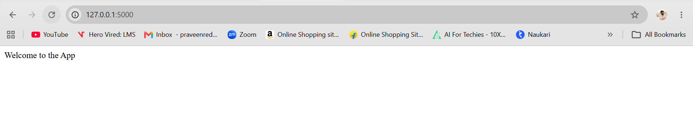
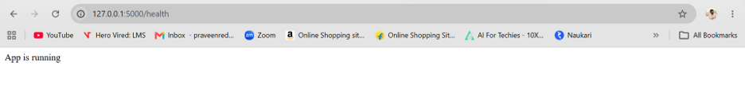
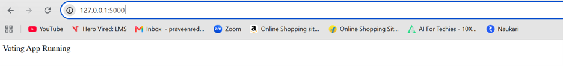
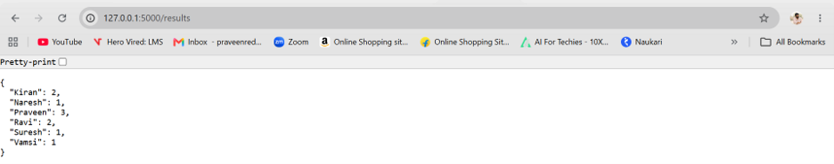
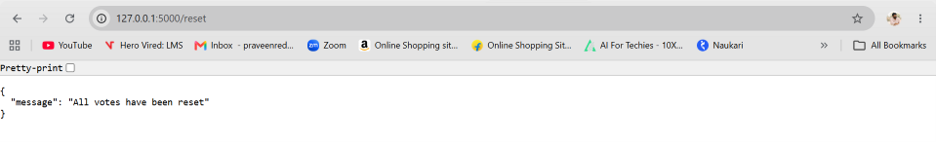
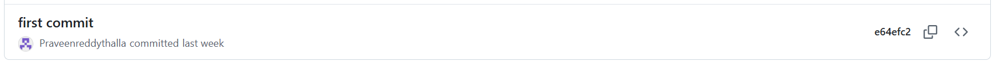
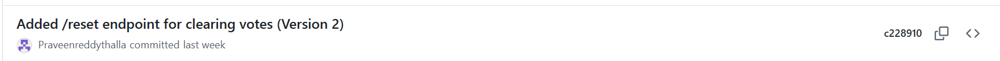

# Flask Voting Application

## Project Description

This project is a simple Flask web application that provides a basic voting system.

* Votes are pre-populated from a static voter list defined in the code (voter_list).

* Each name in the list represents a vote, and duplicates increase the count for that candidate.

* Users can view the application status, check results, and reset votes.

⚠️ Note: There is no live voting endpoint — votes are counted only from the predefined list.

Voting information is stored temporarily in memory while the application is running.

## Installation and Setup

### 1. Clone the Repository

```bash
git clone https://github.com/Praveenreddythalla/flask_assignment_dev.git
cd flask_assignment_dev
```

### 2. Create a Virtual Environment

```bash
python -m venv venv
```

### 3. Activate the Virtual Environment

For PowerShell:

```powershell
.\venv\Scripts\Activate.ps1
```

### 4. Install Dependencies

```bash
pip install flask
```

### 5. Run the Application

```bash
python app.py
```

The application will be available at:

```text
http://localhost:5000
```

## API Endpoint Reference

| Endpoint       | Method | Description                                       |
| -------------- | ------ | ------------------------------------------------- |
| `/`            | GET    | Displays the welcome message                      |
| `/health`      | GET    | Checks whether the application is running         |
| `/vote/<name>` | GET    | Records one vote for the specified candidate      |
| `/results`     | GET    | Returns the current vote count for all candidates |
| `/reset`       | GET    | Clears all stored vote counts                     |

## Voter List
Votes are automatically counted from the following predefined list in app.py:

voter_list = [
    "Praveen", "Ravi", "Suresh", "Naresh", "Kiran", "Vamsi",  # unique
    "Praveen", "Ravi", "Praveen", "Kiran"
]

Each occurrence of a name adds one vote.

Example: "Praveen" appears 3 times → 3 votes.

## Git Workflow

This project uses two Git branches:

* `dev` — Used for development work.
* `main` — Contains the stable version of the application.

### Workflow

```text
        Development
             ↓
            dev
             ↓
       Test the feature
             ↓
       Feature complete
             ↓
       Merge dev → main
             ↓
       Stable release
```

Version 1 was developed and tested in `dev` before being merged into `main`.

Version 2 was developed on top of Version 1 in `dev`, tested, and then merged into `main`.

No application development was performed directly on `main`.

## Version History

| Version   | Features                                           |
| --------- | -------------------------------------------------- |
| Version 1 | Flask application with `/` and `/health` endpoints |
| Version 2 | Added `/results`, and `/reset`; votes auto-counted from a predefined list |

## Screenshots

### 1. Application Running

The application welcome page is displayed when accessing the root endpoint.



### 2. Health Status

The health endpoint confirms that the application is running successfully.



### 3. Vote Recorded

A vote is recorded for the selected candidate using the voting endpoint.



### 4. Vote Results

The results endpoint displays the current vote count for the candidates.



### 5. Reset

The reset endpoint clears all stored vote counts.



## Git Commit History

The following command can be used to verify the evolution of the project from Version 1 to Version 2:

```bash
git log --oneline --graph --decorate --all --no-merges
```

Screenshots are stored in the Screenshots/ folder showing commit and merge history.

### Version 1
- Commit: e64efc2
- Features: Initial Flask app with `/` and `/health` endpoints.



### Version 2
- Commits: c228910
- Features: Added `/vote/<name>`, `/results`, `/reset` endpoints and updated README.



* #### GIT Repositories


* #### GIT Commit History
